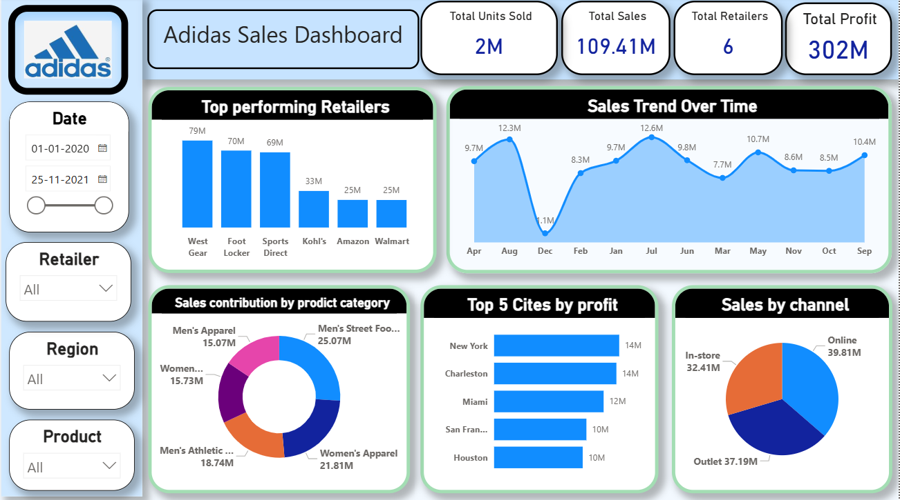

<div align="center">

  

  <h1>Adidas Sales Dashboard</h1>

  <p>An interactive <strong>Power BI</strong> dashboard built to analyze Adidas sales performance across regions, products, retailers, and time periods — enabling data-driven business decisions.</p>

  <p>
    
    
    
    
  </p>

</div>

---

## 📊 Dashboard Preview



> **Interactive filters:** Date range • Retailer • Region • Product category

---

## 🎯 Project Overview

This project analyzes **Adidas US sales data (2020–2021)** to uncover trends in revenue, profitability, and unit sales. The dashboard provides a 360° view of the business — from high-level KPIs down to city-level profit breakdowns — helping stakeholders make faster, more confident decisions.

**What this dashboard answers:**
- Which retailers and regions drive the most revenue?
- How do sales trend month-over-month and year-over-year?
- Which product categories contribute the most to total sales?
- Where are the top profit-generating cities?
- How does sales performance vary across channels (Online vs Outlet vs In-store)?

---

## 📈 Key Insights

| Metric | Value |
|--------|-------|
| 💰 Total Sales | **$109.41M** |
| 📦 Total Units Sold | **2M** |
| 🏪 Total Retailers | **6** |
| 📊 Total Profit | **$302M** |

### 🏆 Top Performing Retailers
| Rank | Retailer | Sales |
|------|----------|-------|
| 1 | West Gear | $79M |
| 2 | Foot Locker | $70M |
| 3 | Sports Direct | $69M |
| 4 | Kohl's | $33M |
| 5 | Amazon | $25M |
| 6 | Walmart | $25M |

### 🛒 Sales by Channel
| Channel | Revenue |
|---------|---------|
| 🌐 Online | $39.81M |
| 🏬 Outlet | $37.19M |
| 🏪 In-store | $32.41M |

### 🏙️ Top 5 Cities by Profit
| Rank | City | Profit |
|------|------|--------|
| 1 | New York | $14M |
| 2 | Charleston | $14M |
| 3 | Miami | $12M |
| 4 | San Francisco | $10M |
| 5 | Houston | $10M |

### 👟 Sales by Product Category
| Category | Sales |
|----------|-------|
| Men's Street Footwear | $25.07M |
| Women's Apparel | $21.81M |
| Men's Athletic Footwear | $18.74M |
| Women's Athletic Footwear | $15.73M |
| Men's Apparel | $15.07M |

---

## 🛠️ Data Cleaning Process (Power Query M)

The raw dataset was cleaned and transformed using **Power Query M** before loading into the data model. Here's a summary of what was done:

### Step 1 — Column Selection
Retained only relevant columns: `Date`, `Retailer`, `Retailer ID`, `Region`, `State`, `City`, `Product`, `Units Sold`, `Total Sales`, `Operating Profit`, `Sales Method`.

### Step 2 — Handle Null / Blank Values
Filtered out rows where `Retailer`, `Total Sales`, or `Units Sold` were null to ensure data integrity.

### Step 3 — Correct Data Types
Applied proper data types — `date`, `Int64`, `number`, `text`, and `Currency` — to all columns for accurate calculations.

### Step 4 — Clean & Standardize Text
Applied `Text.Trim`, `Text.Clean`, and `Text.Proper` on all text columns to remove whitespace, hidden characters, and standardize casing.

### Step 5 — Calculated Columns Added
Derived time-intelligence columns:
- `Year` — extracted from Date
- `Month Name` — full month name
- `Month Number` — for sorting
- `Quarter` — Q1/Q2/Q3/Q4
- `Day of Week` — for weekday-level analysis

### Step 6 — Fix Negative Values
Replaced negative `Total Sales` and `Units Sold` values with `null` to avoid skewing aggregations.

### Step 7 — Currency Formatting
Cast `Total Sales` and `Operating Profit` to `Currency.Type` for proper financial formatting.

### Step 8 — Sort Month Names
Sorted `Month Name` by `Month Number` so visuals display in correct chronological order.

📄 Full M script available in [`adidas_data_cleaning.pdf`](./adidas_data_cleaning.pdf)

---

## 📂 Repository Structure

```
📁 Power-BI---Adidas-Sales-Dashboard/
│
├── 📊 ADIDAS PROJECT 2.pbix        # Complete Power BI dashboard
├── 🖼️  adidas_image.png             # Dashboard screenshot
├── 📄 adidas_data_cleaning.pdf     # Power Query M cleaning script
└── 📝 README.md                    # Project documentation
```

---

## 🚀 How to Use

1. **Clone or download** this repository
   ```bash
   git clone https://github.com/sudhakar/Power-BI---Adidas-Sales-Dashboard.git
   ```

2. **Open the `.pbix` file** in [Microsoft Power BI Desktop](https://powerbi.microsoft.com/desktop)

3. **Explore with interactive filters:**
   - 📅 Date range slider (Jan 2020 – Nov 2021)
   - 🏪 Retailer dropdown
   - 🗺️ Region selector
   - 👟 Product category filter

---

## 🧰 Tools & Technologies

| Tool | Purpose |
|------|---------|
| **Power BI Desktop** | Data modeling, relationships, and dashboard creation |
| **DAX (Data Analysis Expressions)** | Custom KPI measures and calculated fields |
| **Power Query (M Language)** | Data ingestion, transformation, and cleaning |

---

## 📌 About Me

**Sudhakar**
Generative AI Engineer · Bangalore, India

I specialize in building intelligent AI systems — LLMs, RAG pipelines, agentic workflows — and I also enjoy turning raw data into actionable insights through dashboards like this one.

🔗 [GitHub]([https://github.com/sudhakar](https://github.com/Sudhakardamarasingi) &nbsp;|&nbsp; 🔗 [LinkedIn]([https://linkedin.com/in/sudhakar](https://www.linkedin.com/in/sudhakar-damarasingi/)) &nbsp;|&nbsp; 📧 Feel free to connect and share feedback!

---

<div align="center">
  <sub>Built with ❤️ using Microsoft Power BI &nbsp;•&nbsp; ⭐ Star this repo if you found it useful!</sub>
</div>
